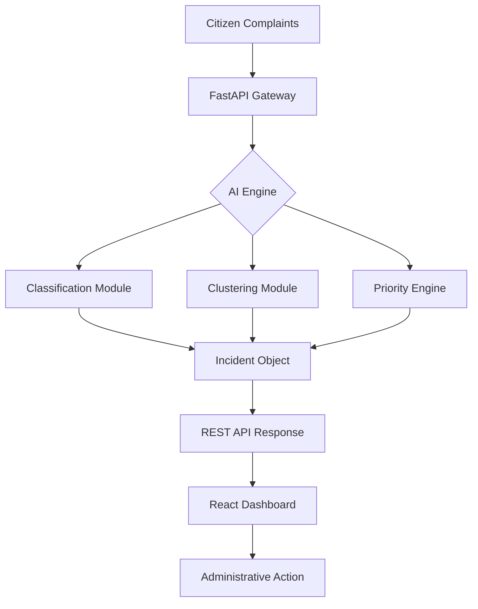

# System Architecture

GIIPS follows a decoupled Client-Server architecture, separating the intelligence processing engine from the administrative visualization layer.

## 📐 High-Level Design

## ⚙️ Component Breakdown

### 1. Data Ingestion Layer
Complaints enter the system via the `/classify` and `/cluster` endpoints. The system handles raw text and metadata (location, timestamp).

### 2. AI Processing Engine
- **Classification**: Uses a trained Scikit-learn pipeline (Vectorizer + Classifier) to assign the complaint to a category (e.g., "Water Supply").
- **Clustering**: Employs semantic similarity matching. Complaints are converted to embeddings, and those exceeding a similarity threshold are grouped into a single unique Incident.
- **Priority Engine**: A weighted scoring system that considers:
    - **Cluster Size**: More reports $
ightarrow$ higher public impact.
    - **Age**: Longer open $
ightarrow$ higher urgency.
    - **Category**: Certain categories (e.g., Sanitation) have higher base weights.
    - **Location**: Proximity to critical infrastructure (hospitals, schools) adds bonus points.

### 3. Decision Support Layer (Frontend)
The React dashboard consumes the processed intelligence to provide:
- **Executive View**: Workload reduction metrics.
- **Operational View**: The Incident Feed, sorted by priority score.
- **Analytical View**: Cluster Explorer to validate AI groupings.

## 🔄 Data Flow
1. **Complaint $
ightarrow$ Category**: Text is classified to ensure it belongs to a supported municipal domain.
2. **Complaint $
ightarrow$ Incident**: The system checks if the complaint is a duplicate of an existing incident using semantic similarity.
3. **Incident $
ightarrow$ Score**: The resulting incident is scored for priority.
4. **Score $
ightarrow$ UI**: The dashboard displays the prioritized list for officer intervention.
