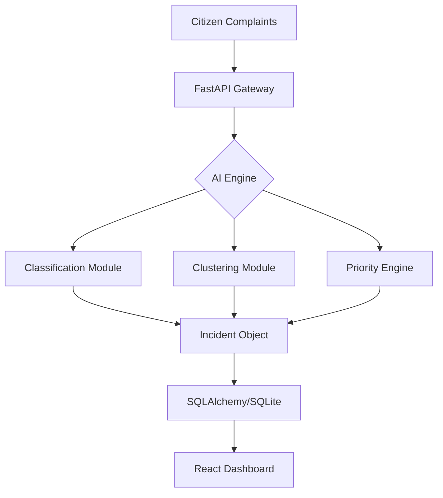

# SYSTEM_ARCHITECTURE.md

GIIPS utilizes a decoupled client-server architecture, separating the heavy AI processing engine from the high-performance visualization dashboard.

## 📐 Overview

## ⚙️ Component Breakdown

### 1. Citizen Flow (Ingestion)
Complaints are submitted through the `/complaints` endpoint. Each complaint is passed through the classification service (to assign a category) and the clustering service (to check for existing duplicate incidents) before being saved.

### 2. AI Pipeline
- **Classification**: Uses a pre-trained Scikit-learn pipeline (Vectorizer + Classifier) to categorize the incoming complaint text.
- **Clustering**: Employs semantic similarity algorithms to compare incoming complaints against existing incidents. If similarity exceeds a defined threshold, the complaint is grouped into an existing cluster.
- **Priority Engine**: A multi-factor scoring algorithm that calculates priority scores based on:
    - **Cluster Size**: Higher volume indicates higher public concern.
    - **Age**: Longer unresolved incidents increase in urgency.
    - **Category/Location**: Critical infrastructure proximity (hospitals/schools) increases priority weights.

### 3. Backend Architecture (FastAPI)
FastAPI provides asynchronous handling of request/response cycles. Data persistence is managed via SQLAlchemy ORM, ensuring schema consistency and reliable ACID transactions for complaint/incident states.

### 4. Database (SQLite)
A local, lightweight database storing:
- `Complaints`: Individual raw inputs.
- `Incidents`: Aggregated clusters of complaints.
- `PriorityHistory`: Auditing for priority changes over time.

### 5. Officer Dashboard (Frontend)
- **Incident Feed**: The operational hub, displaying prioritized incidents for immediate action.
- **Cluster Explorer**: An analytical tool to inspect linked complaints within a specific incident to ensure AI clustering accuracy.

### 6. Executive Dashboard
Aggregated view for higher-level decision makers, focusing on city-wide health metrics, workload reduction statistics, and department-level performance.

### 7. Spatial Intelligence
Geospatial processing that utilizes ward-level data to create heatmaps and forecast future incident volumes based on historical trends.
